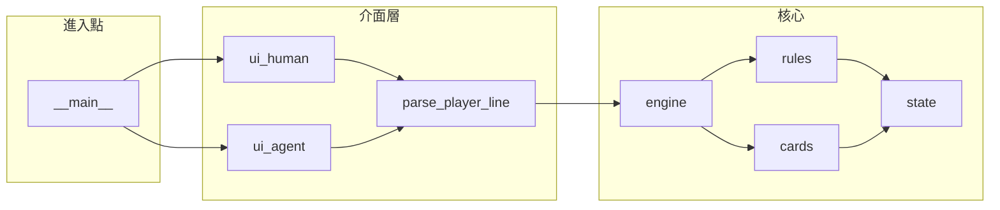

# deck_merger 專案架構

本文件描述程式目錄、模組責任與資料流，供維護與擴充時對照。**遊戲規則之單一真相來源**仍為 [企劃書.md](./企劃書.md)；工程進度見 [MILESTONES.md](./MILESTONES.md)。

---

## 目錄總覽

| 路徑 | 用途 |
|------|------|
| `src/` | 可安裝套件 **`deck_merger`**（`pyproject.toml` 中 `package-dir` 對應至此） |
| `doc/` | 企劃書、里程碑、本架構說明 |
| `tests/` | `pytest`；`conftest.py` 在未 editable 安裝時將 `src/` 掛載為套件 |
| `scripts/` | 可執行腳本（LiteLLM 驅動、提示詞模板） |
| `scripts/prompts/` | `llm_agent` 之 system prompt（對局／局後反思） |
| `knowhow/<版本>/` | 依規則版本注入 LLM 的 Markdown 筆記（可選 `--learn` 追加） |
| `.cursor/skills/` | Cursor Skill（執行 LLM 代理、環境說明） |

---

## 套件模組一覽（`src/` → `deck_merger.*`）

| 模組 | 責任摘要 |
|------|----------|
| `__init__.py` | 套件版本字串 |
| `__main__.py` | CLI：`--agent`／人類模式、`--seed`、`--hand-display`、`--no-default-relics` |
| `state.py` | `GameState`、`Card`（`cid`+`value`）、`RelicId`、`new_game`、勝利檢查等狀態與開局建構 |
| `rules.py` | 回合流程、合成／抽棄牌、里程碑與遺物結算、階段敗北等**規則實作**（與企劃對齊） |
| `cards.py` | 依牌面數字發動效果：`play_cost`、`play_lexicon`、與牌堆互動 |
| `relics.py` | 遺物池、開局／里程碑之二選一選項產生 |
| `engine.py` | `bootstrap_state`、`legal_actions`（含去重）、`apply_action` — **對外「一步」API** |
| `observation.py` | `observation_dict`：精簡 JSON 觀測（人類與 `--agent` 共用形狀） |
| `hand_display.py` | 手牌字串：`stacked`／`spread`、`zone_counts` |
| `ui_commands.py` | `parse_player_line`：文字指令 → `apply_action` 用 `dict`；`legal_action_to_command_hint` |
| `ui_human.py` | 終端人類迴圈 |
| `ui_agent.py` | stdin／stdout 管道：`parse_player_line` + `all_actions`／`{"op":"all_actions"}` |
| `knowhow.py` | 載入 knowhow 目錄、版本解析、`session_notes` 追加 |

---

## 執行時資料流（概念）

- **人類／`--agent`／`scripts/llm_agent.py`** 在「下指令」層皆應收斂到 **`parse_player_line`**（查詢合法步除外）。
- **引擎內部**仍以 `cid` 與結構化 `dict`（`merge`／`merge3`／`play`／`end_turn`／`pick_relic`）執行；**觀測**不強制暴露每張牌 id。

---

## 與外部 LLM 的銜接

| 元件 | 說明 |
|------|------|
| `scripts/llm_agent.py` | 以 LiteLLM 讀寫對局；使用者訊息內含 `observation_dict`；模型輸出**一行文字指令**或 `all_actions` 查詢 |
| `scripts/prompts/deck_merger_agent_system.md` | 對局 system prompt |
| `scripts/prompts/deck_merger_reflect_system.md` | 局後反思（`--learn`）JSON 輸出格式 |
| `.env` | `DECK_MERGER_LLM_MODEL`、各 provider API key（見 `.env.example`） |

---

## 建置與測試（摘要）

| 指令 | 說明 |
|------|------|
| `pip install -e .` | 以 `deck_merger` 名稱從 `src/` 安裝 |
| `pip install -e ".[dev]"` | 含 `pytest` |
| `pytest tests/ -v` | 全量測試 |

更完整步驟見專案根目錄 [README.md](../README.md)。

---

## 延伸閱讀

- [README.md](../README.md) — 指令表、`--agent` 協定、`all_actions`
- [企劃書.md](./企劃書.md) — 規則與用語（含「歷史最大數字」與終端操作說明所依之段落）
